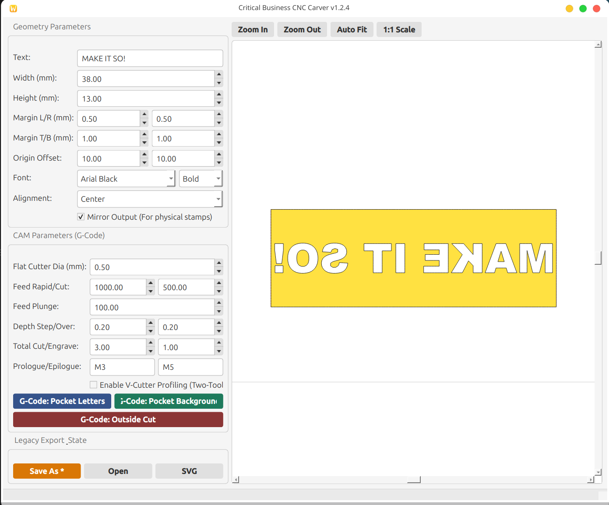
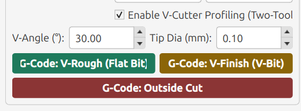

# StampFactory (Critical Business CNC Carver)

A specialized, standalone desktop application designed for rubber stamp makers, engravers, and CNC machinists. 

StampFactory takes standard text and turns it into pristine, true-to-scale CNC toolpaths (G-Code) and vector templates (SVG). It features a robust, Shapely-powered 2.5D CAM engine capable of standard flat-endmill pocketing, as well as advanced Two-Tool V-Carving to protect fragile letters and serifs from snapping during the milling process.

## Modes

### Flat Carve Mode
Standard pocketing and profiling using a flat endmill. Great for large, blocky text.


### V-Carve Mode (Two-Tool Setup)
Preserves delicate text by using a flat bit to clear the background, and an angled V-bit to carve perfectly sloped, pyramidal bases around every letter.


---

## Project Structure

* **`Source/`** - The brains of the operation. Contains the main application (`sf.py`) and the CAM engine (`cam_module.py`).
* **`Stamps/`** - Save your configured stamp designs (`.stmp` files) here so you can edit them later.
* **`Examples/`** - Sample G-code and SVG outputs to test your machine or visualize the toolpaths.
* **`Fonts/`** - A collection of compatible TrueType fonts.
* **`ScreenShots/`** - Images used in this documentation.

---

## The `requirements.txt` Process (Dependency Management)

This project relies on complex math libraries like `shapely` and `build123d`. We use a `requirements.txt` file as a master shopping list so anyone can install exactly what the software needs to run.

### For Users (Installing Dependencies)
You do not need to install packages one by one. Once your virtual environment is active (see Installation Guide below), run:
```bash
pip install -r requirements.txt
```
Python will read the list and download everything required automatically.

### For Developers (Updating the Requirements File)
If you modify the code and add new libraries, you must update the `requirements.txt` file so other users can run your version. 

**Method 1: The Clean Way (Recommended)**
Use `pipreqs` to scan the code and list only the packages explicitly imported.
```bash
pip install pipreqs
pipreqs /path/to/stampfactory --force
```

**Method 2: The Exact Clone Way**
To lock exactly what is currently in your virtual environment (including sub-dependencies):
```bash
pip freeze > requirements.txt
```

---

## Installation Guide (For Non-Programmers)

You don't need to be a Python wizard to run this software, but you do need to set up a "Virtual Environment." Think of this as a clean, isolated sandbox on your computer. It ensures the app has exactly the tools it needs to run without messing up any other software.

### Step 1: Install Python
If you don't have Python installed, download it from [python.org](https://www.python.org/downloads/). *(Windows users: Make sure to check the box that says "Add Python to PATH" during installation!)*

### Step 2: Open Your Terminal
Open your Terminal (Mac/Linux) or Command Prompt (Windows) and navigate into the `stampfactory` folder on your computer.

### Step 3: Create the Virtual Environment
Run this command to create your isolated sandbox (it creates a hidden folder named `.sfenv`):
```bash
python -m venv .sfenv
```

### Step 4: Activate the Environment
You must "turn on" the sandbox before installing or running the app. 
* **Mac/Linux:** 
  ```bash
  source .sfenv/bin/activate
  ```
* **Windows:** 
  ```cmd
  .sfenv\Scripts\activate
  ```
*(You will know it worked if your command prompt now starts with `(.sfenv)`).*

### Step 5: Install Required Software
With the sandbox activated, tell Python to install everything from the requirements list:
```bash
pip install -r requirements.txt
```

---

## How to Configure and Use StampFactory

Whenever you want to use the app, open your terminal, activate your sandbox, and run the main program from the `Source` folder:

```bash
# 1. Activate the environment (if not already active)
source .sfenv/bin/activate  # (Use the Windows command if on PC)

# 2. Launch the app
python Source/sf.py
```

### Basic Workflow & Configuration:
1. **Design:** Type your text, set your physical dimensions (in millimeters), and choose your font.
2. **Align:** Adjust margins and offset to position the text exactly where you want it on your material.
3. **Mirror (Optional):** If you are cutting a physical rubber stamp, check the "Mirror Output" box so it reads correctly when stamped on paper.
4. **Choose CAM Strategy:**
   * **Standard (Flat Carve):** Set your Flat Cutter Diameter and click `Pocket Background` to clear the negative space.
   * **V-Carve (Two-Tool):** Check `Enable V-Cutter Profiling`. Enter your V-Bit angle and tip diameter. Export the `V-Rough` file (run this on your CNC with a flat bit first to clear bulk material), then export the `V-Finish` file (run this second with your V-bit to cut the angled slopes).
5. **Export:** Click the G-Code buttons to save your toolpaths to your computer, or click `SVG` to export a true-to-scale vector graphic for lasers or other software.
